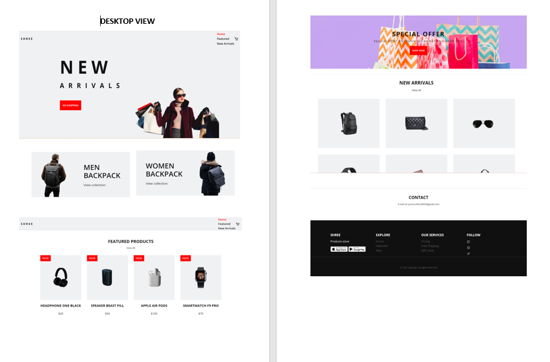

# SHREE - An eCommerce Website

Shree is a fully responsive ecommerce website, maximum compatiblities in all mobile devices, built using HTML, CSS, and JavaScript.

## Demo




## Prerequisites

Before you begin, ensure you have met the following requirements:

* [Git](https://git-scm.com/downloads "Download Git") must be installed on your operating system.

## Installing SHREE

To install **SHREE**, follow these steps:

Windows:

```bash
git clone https://github.com/prernabhola/shree.git
```

## Contact

If you want to contact me you can reach me via [Email](prerna.libra2002@gmail.com).

## License

This project is **free to use** and does not contains any license.